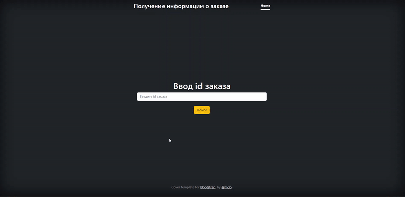
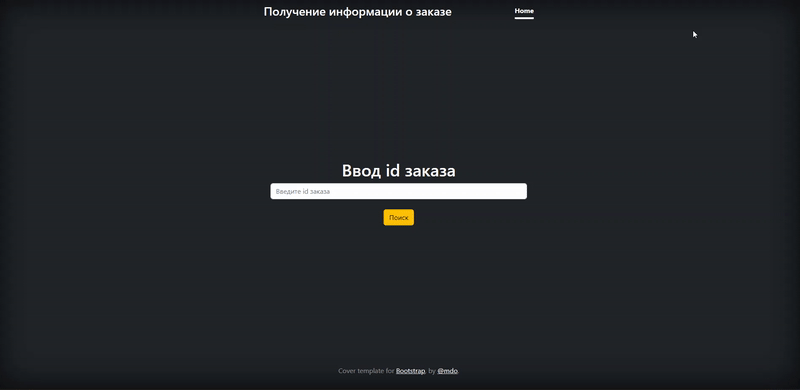

# Go-nats
Реализация сервиса для получения данных от NATS Streaming, и вывод полученных данных в интерфейс.

В сервисе реализовано следующее:
- Подключение и подписка на канал в nats-streaming
- Полученные данные сохраняются в Postgres
- Также полученные данные сохранаются in memory в сервисе (Кэш)
- В случае падения сервиса кэш восстанавливается из Postgres
- Данные выдаются по id из кэша
- Реализован интерфейс отображения полученных данных, для их запроса по id

____
## Пример работы интерфейса

Если данные есть в сервисе:
 

Если данных нет в сервисе:
 
